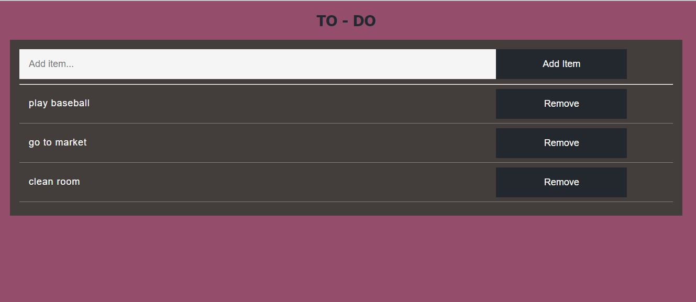
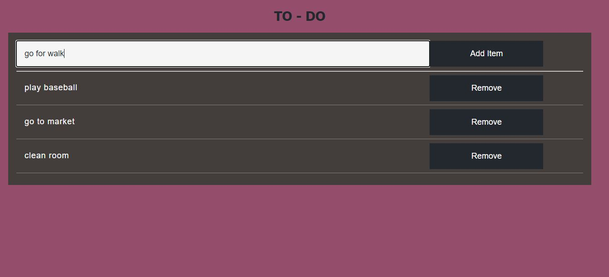
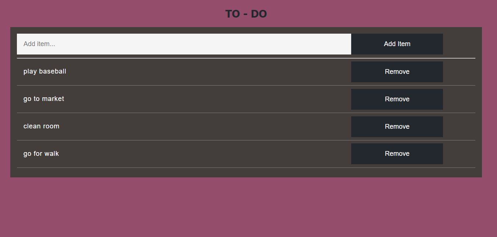

# Todo-App
<hr>

<br>

[](http://forthebadge.com)
[](https://forthebadge.com)

<br>

## About
<h3 align="center"> To keep record of things to be done. </h3>


## Demo
|                  Main page                     |
| -----------------------------------------------|
|       | 


|           Adding New Item                          |               New Item Added At Last                       |
| ---------------------------------------------------|------------------------------------------------------------|
|        |         |


<br>

## Tools used
* NodeJS, HTML
* Database - MongoDB

<br>

## Steps to run

### Database MongoDB
Set up database MongoDB
MongoDB is being used as database.

### Installing depencencies and running the app

* Fork the repository

* Clone the repository  
* Follow the steps as following in the bash

```sh
 cd Instances

 npm install

 npm start
```

* Now head over to http://localhost:1500/todo/add to see it working.

<br>
